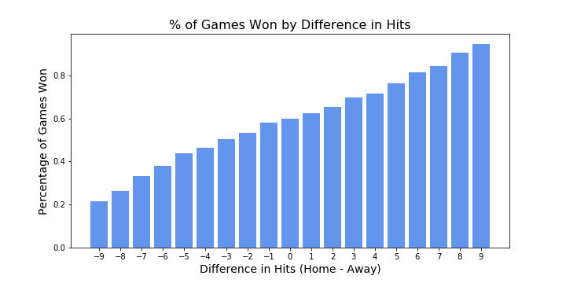
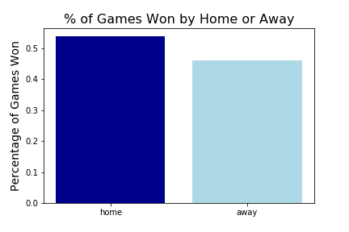
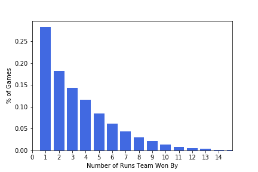
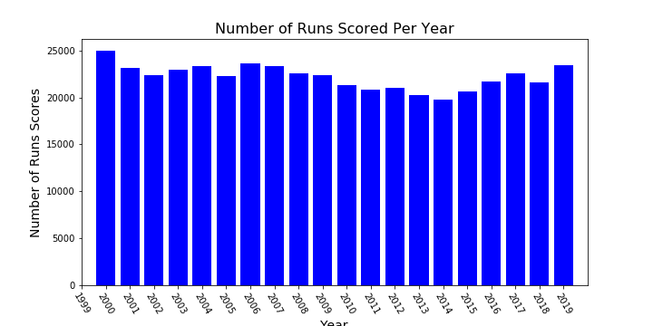
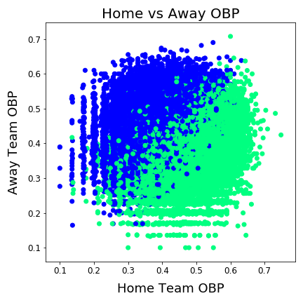

# Betting-Bank

**Authors**: [Justin Fernandez](mailto:justin_miguel_fernandez@gmail.com)

## Problem Overview

Major League Baseball(MLB) has been organizing and playing professional baseball since 1903 and will continue to do so for the foreseable future. With this many years and hundreds of thousands of games played there must be a indicators as to who is going to win each game with a high degree of accuracy. With sports betting becoming more popular throughout the United States in the past 10 years due to legalization in many states, there is even more of a push to find a way to predict the outcome of these games. This project seeks to answer what factors lead to a team winning and also building a model that can predict the outcome.

## Business Case
The sports betting industry has been skyrocketing in value due to the addition of millions of participants in each state due to the legalization of sports betting. There are still many people who are hesitant to risk their money on something they believe to be a coin toss. This project seeks to help those who cannot afford to spend large amounts of time studying the game of baseball by providing an indication as to what team will be victorious. In turn this will get more people on betting sites and no matter the outcome, the betting organizations will increase profit due to the increase in bets.

## The Data
The dataset used in this project was created through the use of [retrosheet.org](https://www.retrosheet.org/) as it has one of the largest collection of MLB statistics and records from the past 100+ years of play. The collected statistics try and capture what happened in the game in terms of batting, fielding, and pitching and can give an indication as to why one team performed better than the other.

The dataset includes features about how each team perfomed in every game leading up to the game that we are predicting the outcome of. This inlcudes features on how that team has batted with statistics like batting average, on base percentage, and commonly recorded statistics like hits, singles, doubles, and many more. Pitching statistics are also being used such as earned runs average, number of pitchers used, and strikeouts. Lastly, fielding statsistics like putouts, assists, and passed balls are used round out the last aspect of the game.

Since the start of baseball, statisticians have been trying to create statistics that capture more information on what is happening in the game than the standard ones. A revolutionary set of statistics created by the [Society for American Baseball Research](https://sabr.org/sabermetrics) (SABR), known as sabermetrics, have been the most impactful to the understanding of baseball. These include weighted on base percentage, fielding independent pitching, batting average on balls in play, and many more.

## Modeling
Working to produce a model that has the highest possible accuracy allowed the testing and use of models with varying degress of interpretability. The metric of the model that will be focused on is accuracy as there is no differnece between false positve and false negatives. The predicitons will be whether the home team wins to not double count the games by predicting if the home and away team wins the same game. There is no class imabalance in this dataset as every team plays 162 games (81 home games) per year with less than 100 games out of 50,000 being cancelled and not rescheduled. The final model that achieved the highest accuracy was a logistic regression model that was grid searched to find the most optimal parameters. The final logistic regression model achieved an accuracy of 57%. XGBoost and logistic regression give feature importance for each feature allowing us to identify the features that impact the outcome of the game the most. Here are those features:

## Conclusions & Next Steps

- The record of each team (home and away) play a major part in the outcome of the game as teams who are winning
	
- The higher rate of assists and putouts by the defense limits the scoring potential of each team
	
- Walks lead to free base runners which increase chance of scoring greatly
	
- Going up against pitchers with low earned runs decreases chance of winning
	
- Wild pitches lead to movement of baserunners and put base runners in scoring position

These are just a couple takeaways from feature importances from the models. One thing to note is that there is no one statstic that can be used to make a large part of a prediction. It is the combination of many stats and how they differ from your opponent.

### Further Research
With more time I would have liked to develop the data set even further. As of now the teams average is the only thing considered for each of the statistics (mostly on batting). Expanding this to have features for each the players in the starting lineup would have been able to capture more information on why a team is performing well.

 

### Navigation
- `Main_notebook.ipynb`: Final notebook containing complete anlysis and modeling
- `exploratory_data_analysis.ipynb`: Exploratory data analysis
- `modeling.ipynb`: Classification modeling for predicting outcome of game
- `feature_engineering.ipynb`: Engineering of features to gain more information
- `creating_cumulative_stat_df.ipynb`: Creating cumulative stats dataframe
- `images`: Folder containing images used in repository
- `baseline_model.py`: Runs 4 baseline classification models
- `dataframe_creation.py`: creating dataframes for prediction